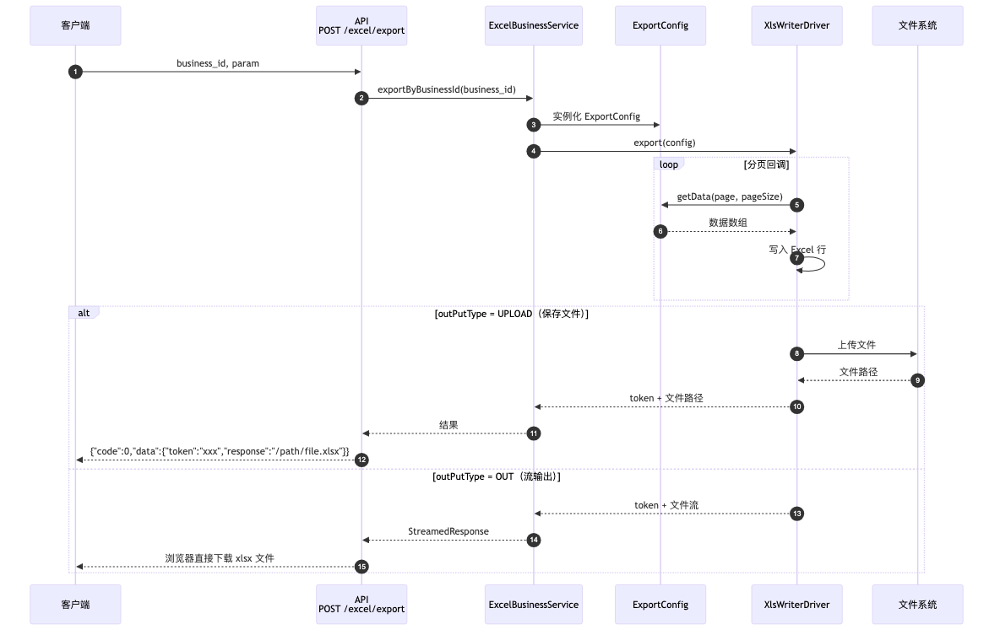
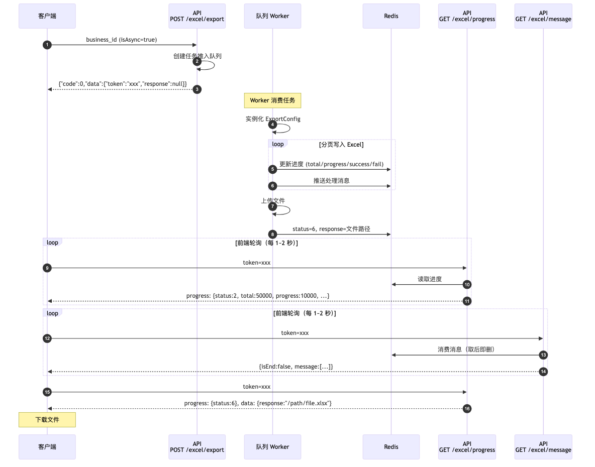

# businessg/laravel-excel

Laravel 框架的 Excel 同步/异步导入导出组件。基于 [businessg/base-excel](https://github.com/businessg/base-excel) 核心库，提供开箱即用的 HTTP 接口自动注册、CLI 命令、进度追踪、消息推送、数据库日志。

---

## 目录

- [1. 环境要求与安装](#1-环境要求与安装)
- [2. 配置参考](#2-配置参考)
  - [2.1 excel.php — 组件核心配置](#21-excelphp--组件核心配置)
  - [2.2 excel_business.php — 业务配置](#22-excel_businessphp--业务配置)
    - [导出配置项说明](#导出配置项说明)
    - [导入配置项说明](#导入配置项说明)
- [3. API 接口参考](#3-api-接口参考)
- [4. 实现一个「导出」完整流程](#4-实现一个导出完整流程)
- [5. 实现一个「导入」完整流程](#5-实现一个导入完整流程)
- [6. 异步导入导出与队列配置](#6-异步导入导出与队列配置)
- [7. 配置类字段与样式参考](#7-配置类字段与样式参考)
  - [7.1 ExportConfig — 导出配置类](#71-exportconfig--导出配置类)
  - [7.2 导出 Sheet](#72-导出-sheet)
  - [7.3 导出 Column](#73-导出-column)
  - [7.4 Style — 单元格样式](#74-style--单元格样式)
  - [7.5 SheetStyle — Sheet 级样式](#75-sheetstyle--sheet-级样式)
  - [7.6 ImportConfig — 导入配置类](#76-importconfig--导入配置类)
  - [7.7 导入 Sheet](#77-导入-sheet)
  - [7.8 导入 Column](#78-导入-column)
- [8. 流程图](#8-流程图)
- [9. 内置 Demo 配置](#9-内置-demo-配置)

---

## 1. 环境要求与安装

### 1.1 环境要求

| 依赖 | 版本 | 说明 |
|---|---|---|
| PHP | >= 8.1 | |
| Laravel | 10.x / 11.x / 12.x | |
| Swoole / Roadrunner | 可选 | 仅异步队列 Worker 运行时需要 |
| Redis 服务 | 任意版本 | 需运行中，用于进度存储和消息队列 |
| MySQL | 5.7+ | 仅 `dbLog.enabled=true` 时需要 |

### 1.2 PHP 扩展

以下 PHP 扩展必须安装并启用：

```bash
# xlswriter — Excel 读写核心驱动
pecl install xlswriter
# 安装后在 php.ini 中添加：extension=xlswriter

# redis — 进度追踪和消息队列依赖
pecl install redis
# 安装后在 php.ini 中添加：extension=redis

# mbstring — 字符串处理（通常已内置）
# 如未启用：apt install php-mbstring 或 yum install php-mbstring
```

验证扩展已安装：

```bash
php -m | grep -E "xlswriter|redis|mbstring"
# 应输出：
# mbstring
# redis
# xlswriter
```

### 1.3 安装

```bash
composer require businessg/laravel-excel
```

> 包已配置 Laravel Package Auto-Discovery，`ExcelServiceProvider` 自动注册，无需手动添加。

### 1.4 依赖组件说明

以下 Composer 包由组件自动引入，无需手动安装。但部分包需要**确认配置已正确**：

| 依赖包 | 用途 | 需要的配置 |
|---|---|---|
| `businessg/base-excel` | 核心库（自动安装） | 无 |
| `illuminate/filesystem` | 导出文件存储 | 确认 `config/filesystems.php` 中有对应的 disk（默认 `local`） |
| `illuminate/redis` | 进度追踪、消息队列 | 确认 `config/database.php` 中 `redis` 连接配置正确 |
| `illuminate/queue` | 异步导入导出 | 确认 `config/queue.php` 中有可用连接（推荐 `redis`） |
| `illuminate/database` | 数据库日志 | 仅 `dbLog.enabled=true` 时需要 |
| `league/flysystem` | 文件系统抽象层（base-excel 依赖） | 无需额外配置 |
| `ramsey/uuid` | 生成任务 token | 无 |

**重点检查项：**

**1) Filesystem（文件系统）**

导出文件默认存储到 `local` 磁盘。确认 `config/filesystems.php` 中配置：

```php
'disks' => [
    'local' => [
        'driver' => 'local',
        'root'   => storage_path('app'),
    ],
],
```

> 如需存储到 OSS/S3 等云存储，安装对应 Flysystem 适配器并修改 `excel.php` 的 `drivers.xlswriter.disk`。

**2) Redis**

确认 `config/database.php` 中 Redis 配置可连接：

```php
'redis' => [
    'client' => env('REDIS_CLIENT', 'phpredis'), // 推荐 phpredis（即 ext-redis）
    'default' => [
        'host'     => env('REDIS_HOST', '127.0.0.1'),
        'password' => env('REDIS_PASSWORD', null),
        'port'     => env('REDIS_PORT', 6379),
        'database' => env('REDIS_DB', 0),
    ],
],
```

**3) Queue（异步模式需要）**

使用异步导入导出时，确认队列连接：

```php
// config/queue.php
'connections' => [
    'redis' => [
        'driver'      => 'redis',
        'connection'  => 'default',
        'queue'       => 'default',
        'retry_after' => 90,
    ],
],
```

### 1.5 发布配置文件

```bash
php artisan vendor:publish --tag=excel-config
```

生成：

- `config/excel.php` — 组件核心配置
- `config/excel_business.php` — 业务导入导出配置

### 1.6 数据库迁移

启用数据库日志（`dbLog.enabled = true`）时执行：

```bash
php artisan migrate
```

创建 `excel_log` 表。建表 SQL 如下（也可手动执行）：

```sql
CREATE TABLE `excel_log` (
    `id`              bigint unsigned NOT NULL AUTO_INCREMENT,
    `token`           varchar(64)  NOT NULL DEFAULT ''  COMMENT '唯一标识',
    `type`            enum('export','import') NOT NULL DEFAULT 'export' COMMENT '类型',
    `config_class`    varchar(250) NOT NULL DEFAULT ''  COMMENT '配置类名',
    `config`          json         DEFAULT NULL         COMMENT '序列化的配置信息',
    `service_name`    varchar(20)  NOT NULL DEFAULT ''  COMMENT '服务名称',
    `sheet_progress`  json         DEFAULT NULL         COMMENT '各 Sheet 进度',
    `progress`        json         DEFAULT NULL         COMMENT '总进度',
    `status`          tinyint unsigned NOT NULL DEFAULT '1' COMMENT '1待处理 2处理中 3处理完成 4失败 5输出中 6完成',
    `data`            json         NOT NULL             COMMENT '结果数据（如文件路径）',
    `remark`          varchar(500) NOT NULL DEFAULT '',
    `url`             varchar(300) NOT NULL DEFAULT ''  COMMENT '导入文件地址',
    `created_at`      timestamp    NOT NULL DEFAULT CURRENT_TIMESTAMP,
    `updated_at`      timestamp    NOT NULL DEFAULT CURRENT_TIMESTAMP ON UPDATE CURRENT_TIMESTAMP,
    PRIMARY KEY (`id`),
    UNIQUE KEY `uniq_token` (`token`)
) ENGINE=InnoDB COMMENT='导入导出日志';
```

---

## 2. 配置参考

### 2.1 excel.php — 组件核心配置

```php
<?php
return [
    /*
    |----------------------------------------------------------------------
    | default — 默认驱动名称
    |----------------------------------------------------------------------
    | 对应下方 drivers 数组中的 key。目前仅支持 xlswriter。
    */
    'default' => 'xlswriter',

    /*
    |----------------------------------------------------------------------
    | drivers — 驱动配置
    |----------------------------------------------------------------------
    | class     : 驱动实现类
    | disk      : 文件系统磁盘名，对应 config/filesystems.php 中的 disks key
    |             导出文件将存储到该磁盘
    | exportDir : 导出文件存放子目录（相对于 disk 根路径）
    | tempDir   : 临时文件目录，null 则使用 sys_get_temp_dir()
    */
    'drivers' => [
        'xlswriter' => [
            'class'     => \BusinessG\BaseExcel\Driver\XlsWriterDriver::class,
            'disk'      => 'local',
            'exportDir' => 'export',
            'tempDir'   => null,
        ],
    ],

    /*
    |----------------------------------------------------------------------
    | logging — 日志配置
    |----------------------------------------------------------------------
    | channel : 日志通道名称，对应 config/logging.php 中的 channels key
    |           组件内部日志（错误、调试）将输出到此通道
    */
    'logging' => [
        'channel' => 'stack',
    ],

    /*
    |----------------------------------------------------------------------
    | queue — 异步队列配置
    |----------------------------------------------------------------------
    | 仅当 ExportConfig/ImportConfig 中 isAsync = true 时生效。
    |
    | connection : 队列连接名，对应 config/queue.php 中的 connections key
    |              如 'redis', 'database', 'sync' 等
    | channel    : 队列名称（Laravel 的 onQueue），如 'default', 'excel' 等
    */
    'queue' => [
        'connection' => 'default',
        'channel'    => 'default',
    ],

    /*
    |----------------------------------------------------------------------
    | progress — Redis 进度追踪配置
    |----------------------------------------------------------------------
    | 前端通过 token 轮询 progress 接口获取实时进度。
    |
    | enabled    : 是否启用进度追踪（false 则不记录进度，接口返回空）
    | prefix     : Redis key 前缀，最终格式 {prefix}:progress:{token}
    | ttl        : 进度数据过期时间（秒），超时后自动清除
    | connection : Redis 连接名，对应 config/database.php 中 redis.connections 的 key
    */
    'progress' => [
        'enabled'    => true,
        'prefix'     => 'LaravelExcel',
        'ttl'        => 3600,
        'connection' => 'default',
    ],

    /*
    |----------------------------------------------------------------------
    | dbLog — 数据库日志配置
    |----------------------------------------------------------------------
    | 将每次导入/导出操作记录到数据库，便于追溯和统计。
    |
    | enabled : 是否启用
    | model   : Eloquent Model 类名，默认使用组件自带的 ExcelLog 模型
    |           可替换为自定义 Model（需实现相同字段）
    */
    'dbLog' => [
        'enabled' => true,
        'model'   => \BusinessG\LaravelExcel\Db\Model\ExcelLog::class,
    ],

    /*
    |----------------------------------------------------------------------
    | cleanup — 临时文件自动清理
    |----------------------------------------------------------------------
    | enabled  : 是否启用
    | maxAge   : 文件最大存活时间（秒），超过此时间未修改的临时文件将被删除
    | interval : 清理任务执行间隔（秒）
    */
    'cleanup' => [
        'enabled'  => true,
        'maxAge'   => 1800,
        'interval' => 3600,
    ],

    /*
    |----------------------------------------------------------------------
    | http — HTTP 接口与响应配置
    |----------------------------------------------------------------------
    |
    | ◆ 路由注册（enabled = true 时生效）:
    |   自动注册 {prefix}/excel/* 路由组，无需手写 Controller 和路由文件。
    |
    | enabled    : 是否自动注册路由。设为 true 启用零代码模式。
    | prefix     : 路由前缀。如 'api' → api/excel/export
    |              如 'common' → common/excel/export
    | middleware : 中间件数组，应用到整个路由组
    |              如 ['api'] 或 [\App\Http\Middleware\Auth::class]
    |
    | ◆ 项目域名:
    | domain     : 项目域名（含协议），用于 info 接口拼接动态模板 URL
    |              当 excel_business.php 中配置了 templateBusinessId 时，
    |              info 接口将返回: {domain}/{prefix}/excel/export?business_id=xxx
    |
    | ◆ 响应 JSON 字段映射:
    | codeField    : 状态码字段名，默认 'code'
    | dataField    : 数据字段名，默认 'data'
    | messageField : 消息字段名，默认 'message'
    | successCode  : 成功时状态码的值，默认 0
    |
    |   默认响应: {"code": 0, "data": {...}, "message": ""}
    |   自定义示例: codeField='status', successCode=200
    |              → {"status": 200, "data": {...}, "message": ""}
    */
    'http' => [
        'enabled'      => false,
        'prefix'       => 'api',
        'middleware'    => ['api'],
        'domain'       => env('APP_URL', 'http://localhost'),
        'codeField'    => 'code',
        'dataField'    => 'data',
        'messageField' => 'message',
        'successCode'  => 0,
    ],
];
```

### 2.2 excel_business.php — 业务配置

此文件注册所有业务的导入导出配置，key 即为 `business_id`。

#### 导出配置项说明

```php
'export' => [
    /*
    | key（如 'orderExport'）即为 business_id，
    | 调用接口时传入此值触发对应的导出逻辑。
    |
    | config : ExportConfig 子类的完整类名（必填）
    |          该类定义了导出的列结构、数据来源、同步/异步、输出方式等。
    */
    'orderExport' => [
        'config' => \App\Excel\OrderExportConfig::class,
    ],
],
```

#### 导入配置项说明

```php
'import' => [
    /*
    | key（如 'orderImport'）即为 business_id。
    |
    | config : ImportConfig 子类的完整类名（必填）
    |          该类定义了导入的列映射、表头行号、行回调处理逻辑等。
    |
    | info   : 可选，附加信息对象。前端通过 GET /excel/info?business_id=xxx 获取。
    |          常用于传递导入模板下载地址。
    |
    |   ◆ info.templateBusinessId — 动态模板（推荐）
    |     值为一个导出 business_id。info 接口会自动拼接为完整 URL:
    |       {http.domain}/{http.prefix}/excel/export?business_id={templateBusinessId}
    |     ⚠️ 对应的导出配置必须满足:
    |       - isAsync = false     （同步执行，不走队列）
    |       - outPutType = 'out'  （直接输出文件流，浏览器访问即下载）
    |
    |   ◆ info.templateUrl — 静态模板
    |     值为完整的 URL 地址，info 接口直接返回。
    |     如: 'https://cdn.example.com/templates/order.xlsx'
    |
    |   两者二选一。如同时配置，templateUrl 优先。
    */
    'orderImport' => [
        'config' => \App\Excel\OrderImportConfig::class,
        'info'   => [
            'templateBusinessId' => 'orderImportTemplate',
        ],
    ],
],
```

---

## 3. API 接口参考

启用 `http.enabled = true` 后自动注册。路径格式为 `{prefix}/excel/{action}`。

### 3.1 导出 — `{prefix}/excel/export`

| 项目 | 说明 |
|---|---|
| 方法 | `GET` 或 `POST` |
| Content-Type | `application/json`（POST 时） |

**请求参数：**

| 参数 | 类型 | 必填 | 说明 |
|---|---|---|---|
| `business_id` | string | 是 | excel_business.php 中注册的导出 key |
| `param` | object | 否 | 传递给 ExportConfig 的自定义参数 |

**响应（异步或同步+UPLOAD）：**

```json
{
    "code": 0,
    "data": {
        "token": "uuid-xxx",
        "response": "/storage/export/2026/03/file.xlsx"
    },
    "message": ""
}
```

> `response` 在异步模式下为 `null`，需通过 progress 接口获取最终文件路径。
> 同步 + OUT 模式时直接返回文件流（浏览器下载），无 JSON 响应。

### 3.2 导入 — `{prefix}/excel/import`

| 项目 | 说明 |
|---|---|
| 方法 | `POST` |
| Content-Type | `application/json` |

**请求参数：**

| 参数 | 类型 | 必填 | 说明 |
|---|---|---|---|
| `business_id` | string | 是 | excel_business.php 中注册的导入 key |
| `url` | string | 是 | Excel 文件的本地绝对路径（由 upload 接口返回） |

**响应：**

```json
{"code": 0, "data": {"token": "uuid-xxx"}, "message": ""}
```

### 3.3 进度查询 — `{prefix}/excel/progress`

| 项目 | 说明 |
|---|---|
| 方法 | `GET` |

**请求参数：**

| 参数 | 类型 | 必填 | 说明 |
|---|---|---|---|
| `token` | string | 是 | 导出/导入返回的 token |

**响应：**

```json
{
    "code": 0,
    "data": {
        "progress": {
            "total": 50000,
            "progress": 10000,
            "success": 9800,
            "fail": 200,
            "status": 2
        },
        "data": {
            "response": "/path/to/file.xlsx"
        }
    }
}
```

**status 状态码：**

| 值 | 含义 |
|---|---|
| 1 | 待处理 — 任务已创建，等待执行 |
| 2 | 处理中 — 正在读取/写入数据 |
| 3 | 处理完成 — 数据处理完毕 |
| 4 | 处理失败 — 出现异常 |
| 5 | 正在输出 — 正在生成最终文件 |
| 6 | 完成 — 全部完成，`data.response` 中包含文件路径 |

### 3.4 消息查询 — `{prefix}/excel/message`

| 项目 | 说明 |
|---|---|
| 方法 | `GET` |

**请求参数：** `token`（必填）

**响应：**

```json
{
    "code": 0,
    "data": {
        "isEnd": false,
        "message": ["第2行: 张三 <zhangsan@example.com> 导入成功", "..."]
    }
}
```

> 消息为**消费式**，取后即删。`isEnd = true` 时表示全部消息已输出完毕，可停止轮询。

### 3.5 导入信息 — `{prefix}/excel/info`

| 项目 | 说明 |
|---|---|
| 方法 | `GET` |

**请求参数：** `business_id`（必填）

**响应：**

```json
{
    "code": 0,
    "data": {
        "templateUrl": "http://localhost/api/excel/export?business_id=orderImportTemplate"
    }
}
```

### 3.6 文件上传 — `{prefix}/excel/upload`

| 项目 | 说明 |
|---|---|
| 方法 | `POST` |
| Content-Type | `multipart/form-data` |

**请求参数：** `file`（必填，.xlsx/.xls，最大 10MB）

**响应：**

```json
{
    "code": 0,
    "data": {
        "path": "/full/path/to/excel-import/2026/03/10/abc.xlsx",
        "url": "/full/path/to/excel-import/2026/03/10/abc.xlsx"
    }
}
```

---

## 4. 实现一个「导出」完整流程

以"订单导出"为例，演示从零实现一个同步导出功能的全过程。

### 第 1 步：启用 HTTP 路由

编辑 `config/excel.php`：

```php
'http' => [
    'enabled'    => true,      // 开启自动路由
    'prefix'     => 'api',     // 接口前缀
    'middleware'  => ['api'],
    'domain'     => env('APP_URL', 'http://localhost'),
    // ...
],
```

### 第 2 步：创建导出配置类

新建 `app/Excel/OrderExportConfig.php`：

```php
<?php

declare(strict_types=1);

namespace App\Excel;

use App\Models\Order;
use BusinessG\BaseExcel\Data\Export\Column;
use BusinessG\BaseExcel\Data\Export\ExportCallbackParam;
use BusinessG\BaseExcel\Data\Export\ExportConfig;
use BusinessG\BaseExcel\Data\Export\Sheet;

class OrderExportConfig extends ExportConfig
{
    /**
     * 服务名称，用于日志标识和 UI 展示
     */
    public string $serviceName = '订单导出';

    /**
     * 是否异步执行：
     *   false — 同步，请求等待导出完成后返回结果
     *   true  — 异步，立即返回 token，后台队列处理
     */
    public bool $isAsync = false;

    /**
     * 输出方式：
     *   OUT_PUT_TYPE_UPLOAD — 生成文件并上传到 filesystem，返回文件路径
     *   OUT_PUT_TYPE_OUT    — 直接输出文件流，浏览器访问即下载（不保存文件）
     */
    public string $outPutType = self::OUT_PUT_TYPE_UPLOAD;

    /**
     * 定义 Sheet 结构：列标题、字段映射、数据来源、分页大小
     */
    public function getSheets(): array
    {
        $this->setSheets([
            new Sheet([
                'name'     => '订单列表',       // Sheet 名称
                'columns'  => [                 // 列定义
                    new Column([
                        'title' => '订单号',     // 列标题（Excel 表头）
                        'field' => 'order_no',  // 数据字段名（对应 getData 返回数组的 key）
                        'width' => 20,          // 列宽（可选）
                    ]),
                    new Column(['title' => '客户名称', 'field' => 'customer_name']),
                    new Column(['title' => '金额',     'field' => 'amount']),
                    new Column(['title' => '状态',     'field' => 'status_text']),
                    new Column(['title' => '创建时间', 'field' => 'created_at']),
                ],
                'count'    => $this->getDataCount(),  // 数据总数（用于进度计算）
                'data'     => [$this, 'getData'],     // 数据回调（分页获取）
                'pageSize' => 1000,                   // 每页条数
            ]),
        ]);
        return $this->sheets;
    }

    public function getDataCount(): int
    {
        return Order::count();
    }

    /**
     * 分页获取数据回调，导出引擎会自动按 pageSize 多次调用
     *
     * @param ExportCallbackParam $param 包含 page（当前页码，从 1 开始）和 pageSize
     * @return array 二维数组，每个元素对应一行数据
     */
    public function getData(ExportCallbackParam $param): array
    {
        return Order::query()
            ->offset(($param->page - 1) * $param->pageSize)
            ->limit($param->pageSize)
            ->get()
            ->map(fn ($order) => [
                'order_no'      => $order->order_no,
                'customer_name' => $order->customer_name,
                'amount'        => $order->amount,
                'status_text'   => $order->status === 1 ? '已完成' : '待处理',
                'created_at'    => $order->created_at->format('Y-m-d H:i:s'),
            ])
            ->toArray();
    }
}
```

### 第 3 步：注册到业务配置

编辑 `config/excel_business.php`：

```php
'export' => [
    'orderExport' => [
        'config' => \App\Excel\OrderExportConfig::class,
    ],
],
```

### 第 4 步：调用

**通过 API 调用：**

```bash
curl -X POST http://localhost/api/excel/export \
  -H "Content-Type: application/json" \
  -d '{"business_id": "orderExport"}'
```

**通过命令行调用：**

```bash
php artisan excel:export "App\Excel\OrderExportConfig"
```

---

## 5. 实现一个「导入」完整流程

以"订单导入"为例，包含**动态导入模板**的完整配置。

### 第 1 步：创建导入模板导出配置

动态模板是一个特殊的导出配置：**同步 + 直接输出（OUT）**，浏览器访问即下载模板文件。

新建 `app/Excel/OrderImportTemplateConfig.php`：

```php
<?php

declare(strict_types=1);

namespace App\Excel;

use BusinessG\BaseExcel\Data\Export\Column;
use BusinessG\BaseExcel\Data\Export\ExportConfig;
use BusinessG\BaseExcel\Data\Export\Sheet;
use BusinessG\BaseExcel\Data\Export\Style;

class OrderImportTemplateConfig extends ExportConfig
{
    public string $serviceName = '订单导入模板';

    /**
     * ⚠️ 必须同步：动态模板要求浏览器请求时同步生成
     */
    public bool $isAsync = false;

    /**
     * ⚠️ 必须直接输出：浏览器 GET 访问时直接触发文件下载
     */
    public string $outPutType = self::OUT_PUT_TYPE_OUT;

    public function getSheets(): array
    {
        $this->setSheets([
            new Sheet([
                'name' => 'sheet1',
                'columns' => [
                    // 第一行：说明行（合并列，带样式）
                    new Column([
                        'title' => implode("\n", [
                            '1、订单号：必填',
                            '2、金额：必填，数字类型',
                            '3、请按照模板格式填写',
                        ]),
                        'field'       => 'order_no',
                        'height'      => 58,
                        'headerStyle' => new Style([
                            'wrap'      => true,
                            'fontColor' => 0x2972F4,
                            'fontSize'  => 10,
                            'bold'      => true,
                            'align'     => [Style::FORMAT_ALIGN_LEFT, Style::FORMAT_ALIGN_VERTICAL_CENTER],
                        ]),
                        // 第二行：实际列标题
                        'children' => [
                            new Column([
                                'title' => '订单号',
                                'field' => 'order_no',
                                'width' => 30,
                            ]),
                            new Column([
                                'title' => '金额',
                                'field' => 'amount',
                                'width' => 20,
                            ]),
                        ],
                    ]),
                ],
                'count'    => 0,     // 模板无数据行
                'data'     => [],
                'pageSize' => 1,
            ]),
        ]);
        return $this->sheets;
    }
}
```

### 第 2 步：创建导入配置类

新建 `app/Excel/OrderImportConfig.php`：

```php
<?php

declare(strict_types=1);

namespace App\Excel;

use App\Models\Order;
use BusinessG\BaseExcel\Data\Import\Column;
use BusinessG\BaseExcel\Data\Import\ImportConfig;
use BusinessG\BaseExcel\Data\Import\ImportRowCallbackParam;
use BusinessG\BaseExcel\Data\Import\Sheet;
use BusinessG\BaseExcel\Exception\ExcelException;
use BusinessG\BaseExcel\ExcelFunctions;

class OrderImportConfig extends ImportConfig
{
    public string $serviceName = '订单导入';
    public bool $isAsync = false;

    public function getSheets(): array
    {
        $this->setSheets([
            new Sheet([
                'name'        => 'sheet1',
                'headerIndex' => 2,   // ⚠️ 模板第 1 行是说明行，第 2 行是列标题
                                      // 若无说明行则设为 1
                'columns'     => [
                    new Column([
                        'title' => '订单号',   // 必须与模板列标题一致
                        'field' => 'order_no', // 映射后的字段名
                    ]),
                    new Column([
                        'title' => '金额',
                        'field' => 'amount',
                    ]),
                ],
                'callback' => [$this, 'rowCallback'],
            ]),
        ]);
        return $this->sheets;
    }

    /**
     * 逐行回调：校验 + 写入数据库
     *
     * @param ImportRowCallbackParam $param
     *   - $param->row      : 当前行数据（key 为上方 column.field）
     *   - $param->rowIndex : 数据行索引（从 0 开始，不含表头）
     *   - $param->config   : ImportConfig 实例（可获取 token）
     */
    public function rowCallback(ImportRowCallbackParam $param): void
    {
        if (empty($param->row)) {
            return;
        }

        $rowNum  = $param->rowIndex + 3; // headerIndex=2，数据从第 3 行开始
        $orderNo = $param->row['order_no'] ?? '';
        $amount  = $param->row['amount'] ?? '';

        if (empty($orderNo)) {
            throw new ExcelException("第{$rowNum}行: 订单号不能为空");
        }

        Order::create([
            'order_no' => $orderNo,
            'amount'   => (float) $amount,
        ]);

        // 推送处理消息（前端通过 message 接口获取）
        if (ExcelFunctions::hasContainer()) {
            ExcelFunctions::progressPushMessage(
                $param->config->getToken(),
                "第{$rowNum}行: 订单 {$orderNo} 导入成功"
            );
        }
    }
}
```

### 第 3 步：注册到业务配置

编辑 `config/excel_business.php`：

```php
'export' => [
    // ... 其他导出
    'orderImportTemplate' => [
        'config' => \App\Excel\OrderImportTemplateConfig::class,
    ],
],

'import' => [
    'orderImport' => [
        'config' => \App\Excel\OrderImportConfig::class,
        'info'   => [
            // 关联导入模板的导出 business_id
            // info 接口将自动返回完整的模板下载 URL
            'templateBusinessId' => 'orderImportTemplate',
        ],
    ],
],
```

### 第 4 步：调用

**API 完整流程：**

```bash
# 1. 获取导入信息（含模板下载地址）
curl "http://localhost/api/excel/info?business_id=orderImport"
# → {"code":0,"data":{"templateUrl":"http://localhost/api/excel/export?business_id=orderImportTemplate"}}

# 2. 下载模板（浏览器直接访问 templateUrl 即下载 xlsx）

# 3. 填写数据后上传
curl -X POST http://localhost/api/excel/upload -F "file=@orders.xlsx"
# → {"code":0,"data":{"path":"/full/path/to/file.xlsx","url":"/full/path/to/file.xlsx"}}

# 4. 执行导入
curl -X POST http://localhost/api/excel/import \
  -H "Content-Type: application/json" \
  -d '{"business_id": "orderImport", "url": "/full/path/to/file.xlsx"}'
# → {"code":0,"data":{"token":"uuid-xxx"}}

# 5. 轮询进度
curl "http://localhost/api/excel/progress?token=uuid-xxx"

# 6. 轮询消息
curl "http://localhost/api/excel/message?token=uuid-xxx"
```

**命令行调用：**

```bash
php artisan excel:import "App\Excel\OrderImportConfig" "/path/to/orders.xlsx"
```

---

## 6. 异步导入导出与队列配置

### 6.1 配置队列连接

确保 `config/queue.php` 中有可用连接（推荐 redis）：

```php
// config/queue.php
'connections' => [
    'redis' => [
        'driver'     => 'redis',
        'connection' => 'default',
        'queue'      => 'default',
        'retry_after' => 90,
    ],
],
```

### 6.2 绑定组件到队列

编辑 `config/excel.php`：

```php
'queue' => [
    'connection' => 'redis',   // 指向 queue.php 中的连接名
    'channel'    => 'excel',   // 队列名称，Worker 监听此队列
],
```

### 6.3 配置类中声明异步

```php
class OrderAsyncExportConfig extends ExportConfig
{
    public bool $isAsync = true;           // ← 关键：开启异步
    public string $outPutType = self::OUT_PUT_TYPE_UPLOAD; // 异步必须用 UPLOAD
    // ...
}
```

> **注意**：异步模式下 `outPutType` 必须为 `UPLOAD`，因为 `OUT`（直接输出）需要同步 HTTP 响应。

### 6.4 启动 Queue Worker

```bash
php artisan queue:work redis --queue=excel
```

### 6.5 异步调用流程

```bash
# 1. 创建异步导出任务 → 立即返回 token
curl -X POST http://localhost/api/excel/export \
  -H "Content-Type: application/json" \
  -d '{"business_id": "orderAsyncExport"}'
# → {"code":0,"data":{"token":"uuid-xxx","response":null}}

# 2. 前端轮询 progress 接口（每秒一次）
#    直到 status=6（完成）或 status=4（失败）

# 3. status=6 时，从 data.data.response 获取文件下载地址
```

---

## 7. 配置类字段与样式参考

所有配置类均通过数组构造（`new Class(['key' => 'value'])`），属性名即数组 key。

### 7.1 ExportConfig — 导出配置类

继承 `ExportConfig` 并覆盖属性或实现 `getSheets()` 方法。

| 属性 | 类型 | 默认值 | 说明 |
|---|---|---|---|
| `$serviceName` | `string` | `'default'` | 服务名称，用于日志标识和 UI 展示 |
| `$isAsync` | `bool` | `false` | 是否异步执行。`true` 时任务推入队列，接口立即返回 token |
| `$outPutType` | `string` | `'out'` | 输出方式。可选值见下方常量 |
| `$isProgress` | `bool` | `true` | 是否启用进度追踪（写入 Redis） |
| `$isDbLog` | `bool` | `true` | 是否写入数据库日志 |
| `$driverName` | `string` | `''` | 驱动名称，空则使用 `excel.php` 中 `default` 配置 |
| `$params` | `array` | `[]` | 自定义参数，API 调用时通过 `param` 字段传入，可在 `getData()` 中使用 |
| `$token` | `string` | `''` | 任务唯一标识，为空时自动生成 UUID |

**outPutType 常量：**

| 常量 | 值 | 说明 |
|---|---|---|
| `ExportConfig::OUT_PUT_TYPE_UPLOAD` | `'upload'` | 生成文件保存到 filesystem，返回文件路径 |
| `ExportConfig::OUT_PUT_TYPE_OUT` | `'out'` | 直接输出文件流，浏览器访问即下载（不落盘） |

> **约束**：`isAsync = true` 时 `outPutType` 必须为 `upload`（异步无法直接输出流）。

**必须实现的方法：**

```php
public function getSheets(): array
{
    $this->setSheets([ new Sheet([...]) ]);
    return $this->sheets;
}
```

### 7.2 导出 Sheet

每个 `Sheet` 对应 Excel 中的一个工作表。

| 属性 | 类型 | 默认值 | 说明 |
|---|---|---|---|
| `$name` | `string` | `'sheet1'` | 工作表名称，显示在 Excel 底部 Tab 上 |
| `$columns` | `Column[]` | `[]` | 列定义数组，决定表头和数据映射 |
| `$count` | `int` | `0` | 数据总行数，用于进度百分比计算。设为 0 则进度条无法显示百分比 |
| `$pageSize` | `int` | `2000` | 分页大小。引擎每次调用 `data` 回调获取 pageSize 条数据 |
| `$data` | `Closure\|array` | `[]` | 数据来源回调。引擎按分页自动调用，签名：`function(ExportCallbackParam $param): array`。也可传二维数组（静态数据） |
| `$style` | `?SheetStyle` | `null` | Sheet 级样式配置（网格线、缩放等），详见 7.5 |
| `$options` | `array` | `[]` | 扩展选项，预留 |

**data 回调参数 `ExportCallbackParam`：**

| 属性 | 类型 | 说明 |
|---|---|---|
| `$page` | `int` | 当前页码（从 1 开始） |
| `$pageSize` | `int` | 每页条数 |
| `$totalCount` | `int` | 总数据量（即 Sheet.count） |
| `$config` | `ExportConfig` | 当前导出配置实例（可获取 params、token 等） |
| `$sheet` | `Sheet` | 当前 Sheet 实例 |
| `$driver` | `DriverInterface` | 驱动实例 |

### 7.3 导出 Column

每个 `Column` 定义一列的表头标题、数据字段映射、宽度和样式。

| 属性 | 类型 | 默认值 | 说明 |
|---|---|---|---|
| `$title` | `string` | `''` | 列标题，显示在 Excel 表头行 |
| `$field` | `string` | `''` | 数据字段名，对应 `getData()` 返回数组中的 key |
| `$width` | `int` | `0` | 列宽（字符数）。0 使用 Excel 默认宽度 |
| `$height` | `int` | `0` | 行高（像素）。通常在含说明行的首列上设置 |
| `$type` | `string` | `''` | 数据类型（预留，当前版本未强制转换） |
| `$callback` | `mixed` | `null` | 单元格值格式化回调。签名：`function($value, $row): mixed`。如需对某列数据做格式转换可使用 |
| `$style` | `?Style` | `null` | **数据单元格**的样式（应用于该列每一行数据） |
| `$headerStyle` | `?Style` | `null` | **表头单元格**的样式（仅应用于该列标题行） |
| `$children` | `Column[]` | `[]` | 子列定义，用于**多行表头**（如第一行是说明行，第二行是实际列标题） |
| `$hasChildren` | `bool` | `false` | 是否有子列（设置 children 后自动为 true） |
| `$col` | `int` | `0` | 列索引（引擎自动计算，通常无需手动设置） |
| `$row` | `int` | `0` | 行索引（引擎自动计算） |
| `$colSpan` | `int` | `0` | 合并列数（引擎根据 children 自动计算） |
| `$rowSpan` | `int` | `0` | 合并行数（引擎自动计算） |
| `$key` | `string` | `''` | 唯一标识（预留） |
| `$options` | `array` | `[]` | 扩展选项 |

**多行表头示例（说明行 + 列标题行）：**

```php
new Column([
    'title'       => "1、姓名：必填\n2、邮箱：必填",  // 第一行：说明文本
    'field'       => 'name',
    'height'      => 58,
    'headerStyle' => new Style([
        'wrap'      => true,           // 自动换行
        'fontColor' => 0x2972F4,       // 蓝色字体
        'fontSize'  => 10,
        'bold'      => true,
        'align'     => [Style::FORMAT_ALIGN_LEFT, Style::FORMAT_ALIGN_VERTICAL_CENTER],
    ]),
    'children' => [                    // 第二行：实际列标题
        new Column(['title' => '姓名', 'field' => 'name',  'width' => 20]),
        new Column(['title' => '邮箱', 'field' => 'email', 'width' => 30]),
    ],
])
```

### 7.4 Style — 单元格样式

`Style` 可应用于 Column 的 `style`（数据行）或 `headerStyle`（表头行）。

| 属性 | 类型 | 默认值 | 说明 |
|---|---|---|---|
| `$bold` | `bool` | `false` | 粗体 |
| `$italic` | `bool` | `false` | 斜体 |
| `$strikeout` | `bool` | `false` | 删除线 |
| `$underline` | `int` | `0` | 下划线样式。0 = 无，可选常量见下方 |
| `$wrap` | `bool` | `false` | 自动换行。标题含 `\n` 时需设为 `true` |
| `$font` | `string` | `''` | 字体名称。如 `'微软雅黑'`、`'Arial'` |
| `$fontSize` | `float` | `0` | 字号。0 使用 Excel 默认（11） |
| `$fontColor` | `int` | `0` | 字体颜色。十六进制 RGB，如 `0xFF0000`（红色）、`0x2972F4`（蓝色） |
| `$backgroundColor` | `int` | `0` | 背景颜色。格式同 fontColor |
| `$backgroundStyle` | `int` | `0` | 背景填充样式。0 = 无，常用 `PATTERN_SOLID`（纯色填充） |
| `$border` | `int` | `0` | 边框样式。0 = 无边框 |
| `$align` | `array` | `[]` | 对齐方式数组。可同时传水平+垂直，如 `[Style::FORMAT_ALIGN_CENTER, Style::FORMAT_ALIGN_VERTICAL_CENTER]` |

**下划线常量：**

| 常量 | 值 | 说明 |
|---|---|---|
| `Style::UNDERLINE_SINGLE` | `1` | 单下划线 |
| `Style::UNDERLINE_DOUBLE` | `2` | 双下划线 |
| `Style::UNDERLINE_SINGLE_ACCOUNTING` | `3` | 会计用单下划线 |
| `Style::UNDERLINE_DOUBLE_ACCOUNTING` | `4` | 会计用双下划线 |

**边框常量：**

| 常量 | 值 | 说明 |
|---|---|---|
| `Style::BORDER_THIN` | `1` | 细线 |
| `Style::BORDER_MEDIUM` | `2` | 中等 |
| `Style::BORDER_DASHED` | `3` | 虚线 |
| `Style::BORDER_DOTTED` | `4` | 点线 |
| `Style::BORDER_THICK` | `5` | 粗线 |
| `Style::BORDER_DOUBLE` | `6` | 双线 |
| `Style::BORDER_HAIR` | `7` | 极细线 |

**对齐常量（水平）：**

| 常量 | 值 | 说明 |
|---|---|---|
| `Style::FORMAT_ALIGN_LEFT` | `1` | 左对齐 |
| `Style::FORMAT_ALIGN_CENTER` | `2` | 居中 |
| `Style::FORMAT_ALIGN_RIGHT` | `3` | 右对齐 |
| `Style::FORMAT_ALIGN_FILL` | `4` | 填充 |
| `Style::FORMAT_ALIGN_JUSTIFY` | `5` | 两端对齐 |

**对齐常量（垂直）：**

| 常量 | 值 | 说明 |
|---|---|---|
| `Style::FORMAT_ALIGN_VERTICAL_TOP` | `8` | 顶端对齐 |
| `Style::FORMAT_ALIGN_VERTICAL_CENTER` | `10` | 垂直居中 |
| `Style::FORMAT_ALIGN_VERTICAL_BOTTOM` | `9` | 底端对齐 |
| `Style::FORMAT_ALIGN_VERTICAL_JUSTIFY` | `11` | 垂直两端对齐 |

**背景填充常量（常用）：**

| 常量 | 值 | 说明 |
|---|---|---|
| `Style::PATTERN_NONE` | `1` | 无填充 |
| `Style::PATTERN_SOLID` | `2` | 纯色填充（最常用） |
| `Style::PATTERN_MEDIUM_GRAY` | `3` | 中灰色 |
| `Style::PATTERN_DARK_GRAY` | `4` | 深灰色 |
| `Style::PATTERN_LIGHT_GRAY` | `5` | 浅灰色 |

**样式综合示例：**

```php
use BusinessG\BaseExcel\Data\Export\Style;

// 表头样式：蓝色加粗居中 + 浅灰背景 + 细边框
$headerStyle = new Style([
    'bold'            => true,
    'fontSize'        => 12,
    'fontColor'       => 0x2972F4,
    'backgroundColor' => 0xF2F2F2,
    'backgroundStyle' => Style::PATTERN_SOLID,
    'border'          => Style::BORDER_THIN,
    'align'           => [Style::FORMAT_ALIGN_CENTER, Style::FORMAT_ALIGN_VERTICAL_CENTER],
]);

// 数据行样式：带边框 + 自动换行
$dataStyle = new Style([
    'border' => Style::BORDER_THIN,
    'wrap'   => true,
    'align'  => [Style::FORMAT_ALIGN_LEFT, Style::FORMAT_ALIGN_VERTICAL_TOP],
]);

// 应用到列
new Column([
    'title'       => '备注',
    'field'       => 'remark',
    'width'       => 40,
    'headerStyle' => $headerStyle,   // 表头单元格样式
    'style'       => $dataStyle,     // 数据单元格样式
])
```

### 7.5 SheetStyle — Sheet 级样式

应用于整个工作表的全局样式。

| 属性 | 类型 | 默认值 | 说明 |
|---|---|---|---|
| `$gridline` | `?int` | `null` | 网格线显示模式。`null` 使用 Excel 默认 |
| `$zoom` | `?int` | `null` | 缩放比例（百分比），如 `150` 表示 150% |
| `$hide` | `bool` | `false` | 是否隐藏此 Sheet |
| `$isFirst` | `bool` | `false` | 是否设为打开时的首个活动 Sheet |

**网格线常量：**

| 常量 | 值 | 说明 |
|---|---|---|
| `SheetStyle::GRIDLINES_HIDE_ALL` | `0` | 隐藏所有网格线 |
| `SheetStyle::GRIDLINES_SHOW_SCREEN` | `1` | 仅屏幕显示 |
| `SheetStyle::GRIDLINES_SHOW_PRINT` | `2` | 仅打印显示 |
| `SheetStyle::GRIDLINES_SHOW_ALL` | `3` | 屏幕 + 打印均显示 |

**使用示例：**

```php
use BusinessG\BaseExcel\Data\Export\SheetStyle;

new Sheet([
    'name'    => '订单列表',
    'style'   => new SheetStyle([
        'gridline' => SheetStyle::GRIDLINES_HIDE_ALL,
        'zoom'     => 120,
    ]),
    'columns' => [...],
    // ...
])
```

### 7.6 ImportConfig — 导入配置类

继承 `ImportConfig` 并实现 `getSheets()` 方法。

| 属性 | 类型 | 默认值 | 说明 |
|---|---|---|---|
| `$serviceName` | `string` | `'default'` | 服务名称，用于日志标识 |
| `$isAsync` | `bool` | `false` | 是否异步执行 |
| `$isProgress` | `bool` | `true` | 是否启用进度追踪 |
| `$isDbLog` | `bool` | `true` | 是否写入数据库日志 |
| `$isReturnSheetData` | `bool` | `false` | 是否将整个 Sheet 数据作为数组返回（而非逐行回调）。`true` 时不触发 callback，而是收集所有行数据返回 |
| `$path` | `string` | `''` | Excel 文件路径。API 调用时由组件自动设置，CLI 调用时需手动传入 |
| `$driverName` | `string` | `''` | 驱动名称，空则使用默认 |
| `$token` | `string` | `''` | 任务唯一标识，空则自动生成 |

### 7.7 导入 Sheet

每个 `Sheet` 对应要读取的一个 Excel 工作表。

| 属性 | 类型 | 默认值 | 说明 |
|---|---|---|---|
| `$name` | `string` | `'sheet1'` | 工作表名称（按名称定位 Sheet） |
| `$readType` | `string` | `'name'` | Sheet 定位方式：`'name'`（按名称）或 `'index'`（按索引） |
| `$index` | `int` | `0` | Sheet 索引（readType='index' 时生效，从 0 开始） |
| `$headerIndex` | `int` | `1` | 表头所在行号（从 1 开始）。如模板第 1 行是说明行、第 2 行是列标题，则设为 `2` |
| `$columns` | `Column[]` | `[]` | 列映射定义数组 |
| `$callback` | `mixed` | `null` | 逐行回调。签名：`function(ImportRowCallbackParam $param): void` |
| `$skipEmptyRow` | `bool` | `true` | 是否跳过空行 |
| `$skipRowIndex` | `bool` | `false` | 是否跳过表头行本身 |
| `$isSetHeader` | `bool` | `false` | 为 true 时在回调中传入原始表头映射信息 |
| `$isReturnSheetData` | `bool` | `false` | Sheet 级别的返回数据开关（覆盖 ImportConfig 的同名属性） |

**readType 常量：**

| 常量 | 值 | 说明 |
|---|---|---|
| `Sheet::SHEET_READ_TYPE_NAME` | `'name'` | 按名称匹配 Sheet |
| `Sheet::SHEET_READ_TYPE_INDEX` | `'index'` | 按索引匹配 Sheet（第一个 Sheet 为 0） |

**callback 参数 `ImportRowCallbackParam`：**

| 属性 | 类型 | 说明 |
|---|---|---|
| `$row` | `array` | 当前行数据，key 为 Column.field 映射后的字段名 |
| `$rowIndex` | `int` | 数据行索引（从 0 开始，不含表头行） |
| `$config` | `ImportConfig` | 导入配置实例（可获取 token、params 等） |
| `$sheet` | `Sheet` | 当前 Sheet 实例 |
| `$driver` | `DriverInterface` | 驱动实例 |

### 7.8 导入 Column

定义 Excel 列标题到代码字段名的映射关系。

| 属性 | 类型 | 默认值 | 说明 |
|---|---|---|---|
| `$title` | `string` | `''` | Excel 表头列标题。**必须与实际 Excel 文件中的列标题完全一致**，引擎通过标题匹配列位置 |
| `$field` | `string` | `''` | 映射后的字段名。回调中 `$param->row[$field]` 获取该列值 |
| `$type` | `int` | `TYPE_STRING` | 数据类型，读取时自动转换 |

**数据类型常量：**

| 常量 | 值 | 说明 |
|---|---|---|
| `Column::TYPE_STRING` | `0x01` | 字符串（默认） |
| `Column::TYPE_INT` | `0x02` | 整数 |
| `Column::TYPE_DOUBLE` | `0x04` | 浮点数 |
| `Column::TYPE_TIMESTAMP` | `0x08` | 时间戳 |

---

## 8. 流程图

### 8.1 同步导出时序图



### 8.2 异步导出时序图



### 8.3 导入流程时序图（含动态模板）


---

## 9. 内置 Demo 配置

组件预置以下 Demo 配置，发布配置后即可直接使用，便于快速验证：

| business_id | 配置类 | 同步/异步 | 输出方式 | 说明 |
|---|---|---|---|---|
| `demoExport` | DemoExportConfig | 同步 | UPLOAD | 100 条虚拟数据，返回文件路径 |
| `demoExportOut` | DemoExportOutConfig | 同步 | OUT | 20 条数据，浏览器直接下载 |
| `demoAsyncExport` | DemoAsyncExportConfig | 异步 | UPLOAD | 5 万条数据，带进度消息推送 |
| `demoExportForImport` | DemoExportForImportConfig | 同步 | UPLOAD | 5 条姓名/邮箱数据，供导入测试 |
| `demoImportTemplate` | DemoImportTemplateExportConfig | 同步 | OUT | 带样式说明行的导入模板 |
| `demoImport` | DemoImportConfig | 同步 | — | 逐行校验姓名/邮箱 + 消息推送 |

**快速验证：** 只需 `http.enabled = true`，即可通过以下方式测试：

```bash
# 同步导出
curl -X POST http://localhost/api/excel/export -H "Content-Type: application/json" \
  -d '{"business_id": "demoExport"}'

# 浏览器直接下载
# GET http://localhost/api/excel/export?business_id=demoExportOut

# 异步导出
curl -X POST http://localhost/api/excel/export -H "Content-Type: application/json" \
  -d '{"business_id": "demoAsyncExport"}'
```

---

## License

MIT
